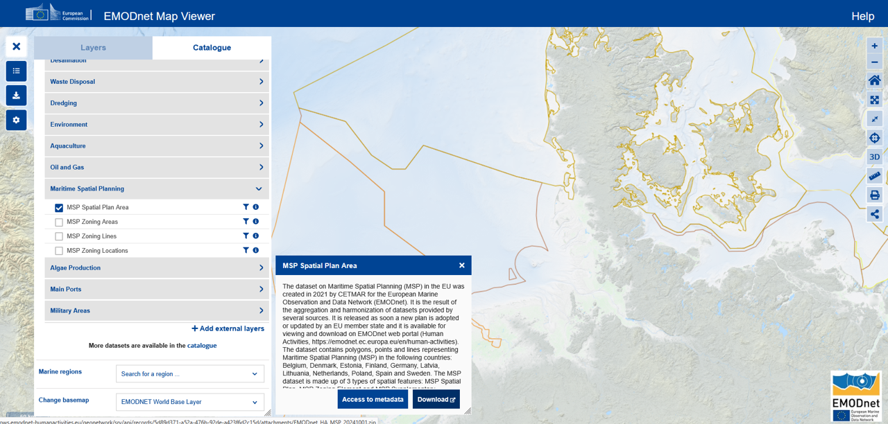

# Intro

Underwater (submarine) cables include cables use for telecommunication and for power.
Although limited impacts have been found, the disturbance of the seabed during installation can disrupt benthic communities. Power cables additionally emit electromagnetic fields (EMFs) which might afect sensitive species such as migratory animals. Furthermore, these cables can warm the water surrounding them, and the effects of this are poorly known. 

<html>
<body>
   <left>
      <a href="https://www.sa-world.com/images/econa-article-images/260/full/Untitled%20design(72).jpg" style="width:450px"></a>
      </a>
   </left>
</body>
</html>
Source: [Sa-word](https://www.sa-world.com/blog/ztt-has-concluded-installing-the-gode-wind-3-submarine-cable-in-the-german-north-sea.html)

# Data

There are two  main installations: telecommunications (which for example provide internet access) and power (transporting energy, for example from wind farms to land)

<html>
<body>
   <left>
      <a href="https://energyindustryreview.com/wp-content/uploads/2022/03/submarin-cable-layout.jpg"></a>
   </left>
</body>
</html>
Germany Mecklenburg-Western Pomerania Baltic Sea – undersea cable to Hiddensee island. 


To download the the dataset on subsea telecommunication and power cables, this information available at the European Marine Observation and Data Network (EMODnet). <br>
This dataset is updated every year, and is available for viewing and download on the EMODnet web portal>[Human Activities](https://emodnet.ec.europa.eu/en/human-activities). 

```{r, echo=FALSE,fig.width=5, fig.height=4}

```

# Read

Prepare to read shapefiles, by providing the folder where the data is stored.

```{r}
library(here)
library(sf)
```

```{r, echo=TRUE}
This_directory<-here()
```

```{r,echo=FALSE, include=FALSE}
This_directory<-"C:\\Users\\lerma\\OneDrive\\Documents\\03Academico\\02Proyectos-Postdoc\\2025\\1Programming\\2Packages\\TestData\\Cables\\"
list.files(This_directory)
Germany_telecommunications<-st_read(paste0(This_directory,"/DE_BSH_CONTIS_Data_CablesLine.shp"))
France_telecommunications<-st_read(paste0(This_directory,"/FR_SIGCables_Submarine_Cables_Routes.shp"))
Netherlands_telecommunications<-st_read(paste0(This_directory,"/NL_Rijkswaterstaat_Telecom_kabels_noordzee.shp"))
Germany_voltage<-st_read(paste0(This_directory,"/DE_BSH_CONTIS_High_Voltage_CablesLine.shp"))
Netherlands_voltage<-st_read(paste0(This_directory,"/NL_Rijkswaterstaat_Electra_kabels_noordzee.shp"))
Norway_voltage<-st_read(paste0(This_directory,"/NO_NVE_Sjokabel.shp"))
```

The relevant files for the telecommunication lines in the German North Sea are in the files from German, France and Netherlands telecommunications.

```{r, echo=TRUE, eval=FALSE}
Germany_telecommunications<-st_read(paste0(This_directory,"/DE_BSH_CONTIS_Data_CablesLine.shp"))
France_telecommunications<-st_read(paste0(This_directory,"/FR_SIGCables_Submarine_Cables_Routes.shp"))
Netherlands_telecommunications<-st_read(paste0(This_directory,"/NL_Rijkswaterstaat_Telecom_kabels_noordzee.shp"))
```

The relevant files for the power lines in the German North Sea are in the files form German, France and Norway cables.

```{r, echo=TRUE, eval=FALSE}
Germany_voltage<-st_read(paste0(This_directory,"/DE_BSH_CONTIS_High_Voltage_CablesLine.shp"))
Netherlands_voltage<-st_read(paste0(This_directory,"/NL_Rijkswaterstaat_Electra_kabels_noordzee.shp"))
Norway_voltage<-st_read(paste0(This_directory,"/NO_NVE_Sjokabel.shp"))
```

# Base Map

Load ggplot to start creating visualizations. 

```{r}
library(ggplot2)
```

Create a base map using shapefiles from the package GermanNorthSea. 

```{r}
library(GermanNorthSea)
```

Add the attributes and the theme to your base map.

```{r, fig.height=6, fig.width=8}
Base_map<-ggplot() + 
  # Fill colors
  geom_sf(data = GermanNorthSea::German_EEZ, color='#43585E',fill='transparent',alpha=0.1, linewidth = 1)+
  geom_sf(data = German_land, colour = '#43585E', fill = '#43585E')+
  
  geom_sf(data = GermanNorthSea::German_SCA, colour = '#43585E', fill = NA, 
          linewidth=0.1, linetype = "dashed",alpha=0.3)+
  geom_sf(data = GermanNorthSea::German_natura, colour = '#43585E', fill = NA, 
          linewidth=0.1, linetype = "dashed",alpha=0.3)+
  
  scale_x_continuous(breaks = c(4,6,8),labels = function(x) paste0(x, '\u00B0')) +
  scale_y_continuous(breaks = c(53.5,54.5,55.5),labels = function(x) paste0(x, '\u00B0'))  +
  
  theme(
  axis.text.x = element_text(size=10,vjust = 12,color='#3d5a80'),
  axis.text.y = element_text(color='#3d5a80',size=10,margin = margin(0,-1.30,0,1, unit = 'cm')),
  axis.title = element_blank(),
  axis.ticks.length=unit(-0.20, "cm"),
  panel.grid.major = element_blank(),
  panel.grid.minor = element_blank(),
  panel.background = element_rect(fill = '#F2F2F2'))+
  
  xlab('Longitude')+ylab('Latitude')+
  
  theme(panel.border = element_rect(colour = "black", fill=NA, linewidth=1.5))
```

## Telecommunications

```{r}
Base_map +
  geom_sf(data = Netherlands_telecommunications,color='green')+
  geom_sf(data = France_telecommunications,color='blue')+
  geom_sf(data = Germany_telecommunications, color='red')+
  coord_sf(xlim = c(3900000,4250000), ylim = c(3350000,3680000),
                    label_axes = list(left = "N", bottom = 'E'))
```

## Power

```{r}
Base_map +
  geom_sf(data = Netherlands_voltage,color='green')+
  geom_sf(data = Norway_voltage,color='blue')+
  geom_sf(data = Germany_voltage, color='red')+
  coord_sf(xlim = c(3900000,4250000), ylim = c(3350000,3680000),
                    label_axes = list(left = "N", bottom = 'E'))
```

Note than in Germany, many of the power cables are connected to their OWF


```{r}
Base_map +
  geom_sf(data = Netherlands_voltage,color='green')+
  geom_sf(data = Norway_voltage,color='blue')+
  geom_sf(data = Germany_voltage, color='red')+
  geom_sf(data = GermanNorthSea::OWF_EMODnet, color='grey', alpha=0.5)+
  coord_sf(xlim = c(3900000,4250000), ylim = c(3350000,3680000),
                    label_axes = list(left = "N", bottom = 'E'))
```
<html>
<body>
   <left>
      <a href="https://img.offshore-mag.com/files/base/ebm/os/image/2024/02/65cf9e769eb5bc001ee30b5e-balwin_amprion.png?auto=format,compress&fit=max&q=45" style="width:450px"></a></a>
   </left>
</body>
</html>

Source: [Offshore mag](https://www.offshore-mag.com/renewable-energy/article/14305254/prysmian-supplying-cables-for-two-german-offshore-wind-farms)


```{r, echo=FALSE, eval=FALSE}
# Export
library(here)
here()
My_directory<-paste0(here(),"/_posts/2025-09-15-cables")
ggsave(Plot_cables,
       filename = paste0(My_directory,"/cables.jpeg"),
       width = 8, 
       height = 6)
```

# References

- [Video](https://youtu.be/Gg1aFmsKQgk)
- [Buck et al 2024](https://www.researchgate.net/publication/235938669_Extensive_open_ocean_aquaculture_development_within_wind_farms_in_Germany_The_prospect_of_offshore_co-management_and_legal_constraints)


