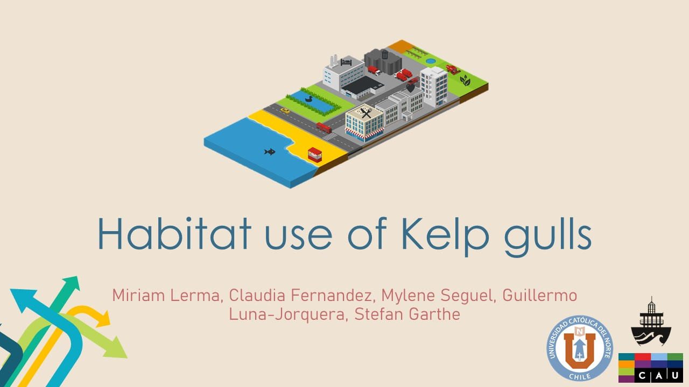

```{r setup, include=FALSE}
knitr::opts_chunk$set(echo = FALSE)
library(distilltools)
```


# Intro

This post is dedicated to the poster and presentation for the 50TH ANNUAL MEETING OF THE PACIFIC SEABIRD GROUP (https://psg.wildapricot.org/Annual-Meeting)

Habitat use of Kelp gulls

⚡⚡⚡⚡

```{r icon-links1,echo=FALSE, include=TRUE}
icon_link(icon = "fas fa-images",
          text = "Download presentation",
          url = "https://raw.githubusercontent.com/MiriamLL/miriamlerma_/main/_posts/psg2023/Gulls_psg.pdf")
```

```{r, echo=FALSE}
library(here)
File<-paste0(here(),"/_posts/psg2023/")
Imagen1<-paste0(File,"PSG2023.jpg")
```

```{r, fig.height=6,echo=FALSE, fig.align='center', eval=FALSE}
knitr::include_graphics(Imagen1)
```


<html>
<body>
   <center>
      <a href="https://raw.githubusercontent.com/MiriamLL/miriamlerma_/main/_posts/psg2023/Gulls_psg.pdf"></a>
   </center>
</body>
</html>


⚡⚡⚡⚡

## Authors

**Miriam Lerma**, Claudia Fernandez, Mylene Seguel, Guillermo Luna-Jorquera, Stefan Garthe


## References
By alphabetic order

1. Cotter et al. 2012 [Link](https://www.researchgate.net/publication/270569895_Population_status_distribution_and_trends_of_gulls_and_kittiwakes_breeding_in_eastern_Canada_1998-2007?enrichId=rgreq-2f48f2578f5db70e85898393ba5fc46e-XXX&enrichSource=Y292ZXJQYWdlOzI3MDU2OTg5NTtBUzoxODMwNzQ2NzEzMDg4MDFAMTQyMDY1OTgxMTY1OQ%3D%3D&el=1_x_2&_esc=publicationCoverPdf)

2. Duhem et al. 2008 [Link](https://esj-journals.onlinelibrary.wiley.com/doi/abs/10.1007/s10144-007-0059-z)

3. Kasinsky et al. 2018 [Link](https://bioone.org/journals/waterbirds/volume-41/issue-3/063.041.0308/Kelp-Gull-Larus-dominicanus-Use-of-Alternative-Feeding-Habitats-at/10.1675/063.041.0308.short)

4. Lenzi et al. 2016 [Link](https://www.researchgate.net/project/The-impact-of-plastic-pollution-on-the-ecology-of-seabirds)

5. Lenzi et al. 2018 [Link](https://hammer.purdue.edu/articles/thesis/THE_IMPACT_OF_REFUSE_ON_THE_KELP_GULL_LARUS_DOMINICANUS_IN_THE_R_O_DE_LA_PLATA_ESTUARY_URUGUAY/7403657)

6. Liznizer et al. 2011 [Link](https://www.researchgate.net/publication/263002196_Spatial_and_temporal_variation_in_population_trends_of_Kelp_Gulls_in_northern_Patagonia_Argentina)

7. Ludynia et al. 2005 [Link](https://bioone.org/journals/waterbirds/volume-28/issue-3/1524-4695_2005_028_0359_SARVIT_2.0.CO_2/Seasonal-and-Regional-Variation-in-the-Diet-of-the-Kelp/10.1675/1524-4695(2005)028[0359:SARVIT]2.0.CO;2.short)

8. Neubauer et al. 2006 [Link](https://www.iop.krakow.pl/pobierz-publikacje,1203)
Pasten-Araya 2021 [Link](https://aveschile.cl/wp-content/uploads/2021/12/7.-Pasten-Araya_et_al.pdf)

9. Oro et al. 2013 [Link](https://www.researchgate.net/publication/258054052_Ecological_and_evolutionary_implications_of_food_subsidies_from_humans?_sg%5B0%5D=ibjhPvOXCyFo4LT4r1gpklrVPzVIdkMVG2PF10ou39e7eECmg-kGBpxwjHxQu-zHAND4elun1uxPsBM.5o3McySY6PCObQ02pjClRtwIToj67KJHxd4XLMK7_VZ7YuCV9RrCNEl30ApwjkvQnYn4BTI0jQJTDzs7yFfwRg&_sg%5B1%5D=g-s_fCH2DyQ8mlwfWjNHNK7DlWoIu7Oncol1CaZqaUxBlK_MCZEXwl2qYbJztEIt0UpG6iNCQGiTsYq0leer1AwReNQ.5o3McySY6PCObQ02pjClRtwIToj67KJHxd4XLMK7_VZ7YuCV9RrCNEl30ApwjkvQnYn4BTI0jQJTDzs7yFfwRg&_sg%5B2%5D=YPDaewKuN0qslXmEAO_q81De3hO38q5VNGoJnkkF-kxrjuIg-PzcmmhHNUU96V-V1eBi--zhWWc96Qh9yw.5o3McySY6PCObQ02pjClRtwIToj67KJHxd4XLMK7_VZ7YuCV9RrCNEl30ApwjkvQnYn4BTI0jQJTDzs7yFfwRg&_sgd%5Bpr%5D=1)

10. Reusch 2020 [Link](https://movementecologyjournal.biomedcentral.com/articles/10.1186/s40462-020-00221-x)

11. Rodriguez 2012 [Link](https://pubmed.ncbi.nlm.nih.gov/23060519/)

12. Simeone and Luna-Jorquera 2012 [Link](https://www.researchgate.net/publication/244283287_Estimating_rat_predation_on_Humboldt_Penguin_colonies_in_north-central_Chile)

13. Spelt et al. 2019 [Link](https://www.nature.com/articles/s41598-019-46890-6)

14. Witteveen et al. 2017 [Link](https://www.sciencedirect.com/science/article/abs/pii/S0025326X16308694?via%3Dihub)

15. Yoda et al. 2012 [Link](https://esj-journals.onlinelibrary.wiley.com/doi/abs/10.1007/s10144-007-0059-z)

16. Yorio et al. 2016 [Link](https://bioone.org/journals/waterbirds/volume-39/issue-sp1/063.039.sp103/Distribution-and-Trends-in-Kelp-Gull-Larus-dominicanus-Coastal-Breeding/10.1675/063.039.sp103.short)
