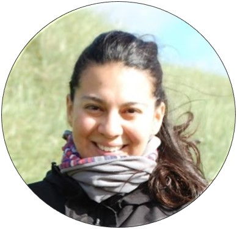

```{r load_packages, message=FALSE, warning=FALSE, include=FALSE}
library(fontawesome)
library(distilltools)
```

```{r, fig.height=10,echo=FALSE, fig.align='center'}

```

<center>
<left>
```{r icon-links8,eval=FALSE,echo=FALSE}
icon_link(icon = "fab fa-mastodon",
          text = "mastodon",
          url = "https://ecoevo.social/@miriamlerma")
```


```{r icon-links7,eval=FALSE,echo=FALSE}
icon_link(icon = "fab fa-github-alt",
          text = "github",
          url = "https://github.com/MiriamLL")
```


```{r icon-links6,eval=FALSE,echo=FALSE}
icon_link(icon = "fab fa-linkedin-in",
          text = "linkedin",
          url = "https://www.linkedin.com/in/miriam-lerma/")
```
</center>

### `r fa("chevron-circle-down", fill = "black")` About  me
I am a postdoctoral researcher at West Coast Research and Technology Center [FTZ](https://www.ftz.uni-kiel.de/de) in Büsum, Germany and part of the Seevogelmonitoring team at the Dachverband Deutscher Avifaunisten [DDA](https://www.dda-web.de/). 

My work entitles analyzing spatial patterns of marine animals while collaborating on active projects in Mexico and Chile. My focus is coastal and marine animals, in particular shorebirds and seabirds. My research interests include conservation, ecology, physiology, and ecotoxicology. You can download my cv [here](https://raw.githubusercontent.com/MiriamLL/Curriculum/master/CV/CV-Lerma.pdf). 

Currently, I am training technicians and students in [R](https://www.r-project.org/about.html), a programming language for statistical computing and graphics. If you are interested in accessing the materials for this class, which is taught remotely, you can locate them [here](https://www.miriam-lerma.com/materiales.html), please note that these materials are in Spanish. 

I am passionate about nature, biology, and outdoor activities (hiking, kayaking, snorkelling).   

If you are interested in a collaboration, or have any questions, please feel free to email me. 

### `r fa("envelope", fill = "black")` Contact
**Dr. rer. nat. Miriam Lerma** <br>
Email: miriamjlerma@gmail.com

